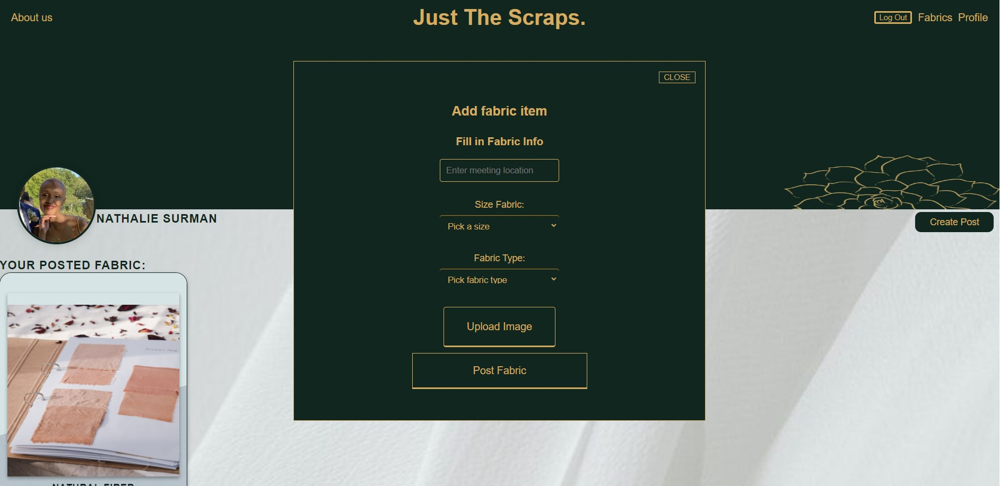

# Just-The-Scraps

Just the Scraps is a free marketplace for fashion designers or people who love to sew but need help with what to do with their extra fabrics to donate them back to the community. 
This website allows you to post your fabrics, rolls of cloth, or fabric scraps, hoping others can make something out of nothing.

## This is the Login page

## Once you have logged in you will be directed to the landing page

## In your profile page you can create a new post

## You can view all available fabrics on the market

## You can click on "I want this" to get product

---

## How to install this project

> **NOTE: You will need 2 terminals for this project to run!** (A split terminal works just as well)

First clone this project

### **First Terminal: The Server**

A `server` folder is provided with the backend code. This is a local server that you will connect to to retrieve/write the data.

1. Open a terminal.
2. Navigate to the server folder: `cd server`.
3. Install the required packages: `yarn install`
4. Once that's done you can start the server: `yarn start`

### **Second Terminal: The Website**

1. Open a terminal.
2. Navigate to the client folder: `cd client`.
3. Install the required packages: `yarn install`
4. Once that's done you can start the client: `yarn start`
